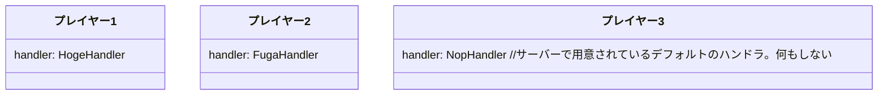

この章では、イベントシステムについて解説します。

## Dragonflyのイベントシステム

Dragonflyのイベントシステムは他のサーバーソフトウェアの機構と異なり、プレイヤー毎・ワールド毎・インベントリー毎等、各要素にそれぞれイベントハンドラを登録し、**イベントの発火元で直接ハンドリング**します([MiNET](https://github.com/NiclasOlofsson/MiNET)に似てるかも？)。

従来のサーバーソフトウェアの多くは発生するイベントの種類毎にハンドリングするため、細かな制御をすべてイベントハンドラ内で行う必要があります。

以下は[PocketMine-MP](https://github.com/pmmp/PocketMine-MP)でのイベントハンドラです。

```php
class HogeListener implements Litener {

	/**
	 * イベントハンドラ
	 * 各プレイヤーがジャンプしたときに発火するイベントを受け取る
	 */
	public function onPlayerJump(PlayerJumpEvent event) {
		// 各プレイヤーがジャンプしたときに発火するイベントを処理する
		// プレイヤーによって処理を変える場合、イベントに格納されているプレイヤーオブジェクトの情報から判断する必要がある
	}
}

// サーバーへイベントハンドラを登録
// サーバー全体でイベントを捉える
$this->getServer()->getPluginManager()->registerEvents($this, new HogeListener());
```

一方で、Dragonflyはイベントハンドラを手続き的に各要素へ登録します。

```go
type HogeHandler struct {
	player.NopHandler // 埋め込み型。デフォルトで用意されているハンドラに処理を委譲する
}

// イベントハンドラ
// funcキーワードの後にレシーバを追加することで構造体に対するメソッドを定義することができる
// *(アスタリスク)はポインタでの宣言を意味する
func (h *HogeHandler) HandleJumb() {
	// 特定のプレイヤーがジャンプした時に発火するイベントを処理する
}

type FugaHandlerHandler struct {
	player.NopHandler
}

func (h *FugaHandler) HandleJump() {
}

// プレイヤーへイベントハンドラを登録
// プレイヤー自体がイベントを捉える
player1.Handle(&HogeEvent {})
// 違うイベントハンドラも登録できる
player2.Handle(&FugaEvent {})
```



---

Dragonflyのイベントシステムにより、**要素毎にハンドラの種類を変えたり、ハンドラを登録しないといった柔軟な選択肢をとることができます**。

## イベント入門

### ハンドラの作成

Dragonflyのイベントハンドラは上記の例の通り、簡単に記述できます。
Dragonflyが用意している各要素向けのハンドラ用のインターフェースを構造体に好きな実装をすることで、その構造体はイベントハンドラとなります。
GoはPHPの`implements`のようにクラスへ明示的にインターフェースを実装するのではなく、構造体が持つメソッドがインターフェースに記述されているメソッドのシグネチャすべてを満たしていることでインターフェースを実装したとコンパイラがみなします(ダックタイピング)。

```go
// イベントハンドラ用の構造体の宣言
type HogeHandler struct {}

// イベントハンドラ
// 実装したいハンドラと同じシグネチャのメソッドを生やすだけ
func (h *HogeHandler) HandleJumb() {}
```

しかし、一つのオブジェクトにつき一つのイベントハンドラ用の構造体となっており、オブジェクトで発生するイベントすべてを一つの構造体で実装しなければなりません。
例えば、Player向けのイベントハンドラ用インターフェースはプレイヤーが発生させるイベントをハンドルするメソッドすべての実装を強制させています。

https://github.com/df-mc/dragonfly/blob/5e79f9e8c55bbe27f13845ac52042942a639e55b/server/player/handler.go#L18-L132

一般的なオブジェクト指向言語にある処理の移譲を行う継承がGoにはないため、Goの言語機能である[構造体の埋め込み](https://gobyexample.com/struct-embedding)を使って目的のハンドラ以外の処理をDragonflyが用意している空実装の`NopHandler`へ移譲します。
明示的にメソッドを上書きすることで`NopHandler`に委譲することなく、任意の処理を実装することができます。

https://github.com/df-mc/dragonfly/blob/5e79f9e8c55bbe27f13845ac52042942a639e55b/server/player/handler.go#L137-L172

```go
type HogeHandler struct {
	player.NopHandler // 埋め込みを使って目的外のメソッドを実装する
}

func (c *HogeHandler) HandleJumb() {}
```

### ハンドラの登録

https://github.com/df-mc/dragonfly/blob/a358977953d38529ca0b040e1b7c4e2a12d498d7/server/player/player.go#L235

プレイヤーの場合は`Player#Handle()`メソッドを使用してハンドラを登録することができます。

https://github.com/df-mc/dragonfly/blob/a358977953d38529ca0b040e1b7c4e2a12d498d7/main.go#L28-L29

`srv.Accept()`の引数には参加したプレイヤーを引数にとる無名関数を渡します。
プレイヤーが参加してくるまで待機し、参加して初めてこの無名関数が実行されます。for文に書かれていることで無限ループとなり、参加してくるすべてのプレイヤーに対応することができます。

```go
for srv.Accept(func(p *player.Player) {
	p.Handle(&HogeHandler{})
}) {}
```

これですべてのプレイヤーの参加時にイベントハンドラを登録することができます。

## イベント発展

### 構造体にフィールドを宣言

構造体にフィールドを定義することで、イベント発火時にフィールドにアクセスすることができます。

```go
type HogeHandler struct {
	player.NopHandler
	// フィールドの宣言
	// ポインタ型で宣言する
	p *player.Player
}

func (h *HogeHandler) HandleJump() {
	// 宣言したフィールドにアクセスする
	h.p.Message("Hello, ", p.Name(), "!")
}

func main() {
	// 省略
	
	for srv.Accept(func(p *player.Player) {
		p.Handle(&HogeHandler{p:p})
	}) {}
}
```

### プレイヤー参加時以外にイベントハンドラを変更

```go
type HogeHandler struct {
	player.NopHandler
	p *player.Player
}

func (h *HogeHandler) HandleJump() {
	h.p.Message("Changing to Fuga Handler")
	h.p.Handle(&FugaHandler{p:h.p})
}

type FugaHandler struct {
	player.NopHandler
	p *player.Player
}

func (h *FugaHandler) HandleJump() {
	h.p.Message("Changing to Hoge Handler")
	h.p.Handle(&HogeHandler{p:h.p})
}

func main() {
	// 省略
	
	for srv.Accept(func(p *player.Player) {
		p.Messgae("Changing to Hoge Handler")
		p.Handle(&HogeHandler{p:p})
	}) {}
}
```

「ミニゲーム開始時に、キューで待機しているプレイヤーにミニゲーム用のイベントハンドラを登録する」など、専用のイベントハンドラを用意し個々の凝集度を高くすることで、コードの見通しがよくなります。